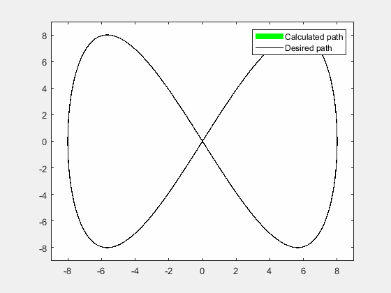

# Inverse Kinematics for Differential Drive Wheeled Mobile Robot
Given a trajectory, we calculate the inverse kinematic variables (wheel velocities) required for the Differential drive based WMR to traverse the trajectory. 
## Simulation results 

